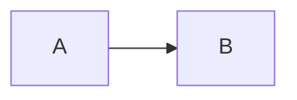
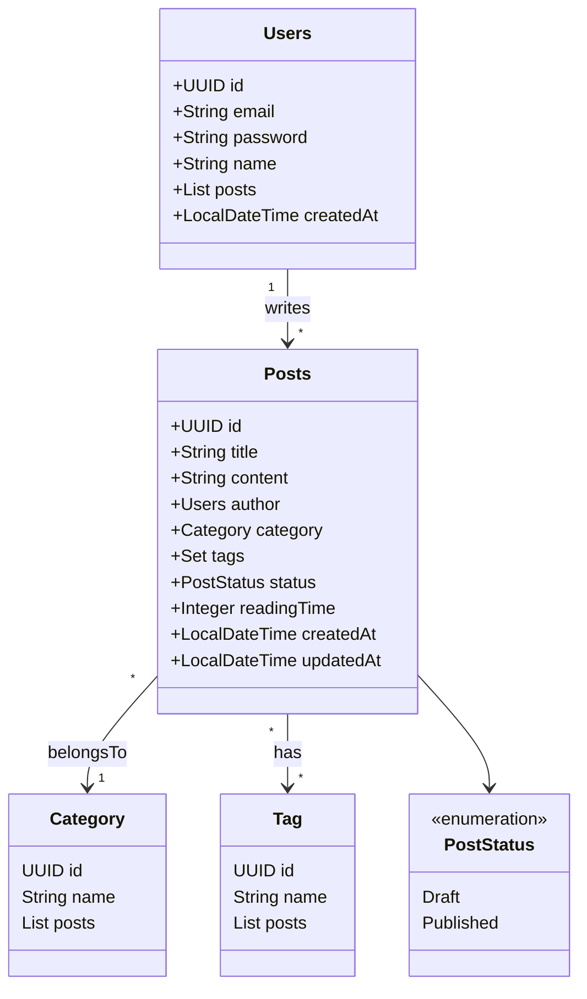

# Blog Seguchidev

## 📌 Product Proposal

The objective of this project is to create a **fullstack blog application** using **Spring Boot** and **Angular** following best practices.  
The Blog serves as a platform to connect with people and practice technical skills.  
If you’re reading this, I hope you enjoy it! 🚀

---

## 📖 Product Overview

- **Summary:**  
  A blog is a platform where users can create content to share thoughts and experiences through written posts.  
  The platform provides an interface for creating, managing, and publishing blog posts while engaging with readers through comments and social interactions.

- **Definitions:**
  - **Post:** A written content with a title, body text, category, optional image, and tags. A post can be a draft or a published article.
  - **Category:** A label to classify blog posts (each post belongs to exactly one category).
  - **Tag:** Keywords to describe the blog post (each post can have multiple tags).

---

## ✅ User Stories

### ✍️ Content Creation

As a **writer**  
I want to **create and edit blog posts with a rich text editor**  
So that I can **express my ideas effectively with proper formatting**

**Acceptance Criteria:**

1. Users can create new posts using a rich text editor
2. Editor supports formatting (bold, italic, headings, lists)
3. Each post must have a title and content body
4. Users can edit existing posts with all changes saved
5. Users can delete posts with a confirmation prompt
6. Posts display an estimated reading time

---

### 🗂 Content Organization

As a **content creator**  
I want to **categorize and tag my posts**  
So that readers can **easily find related content**

**Acceptance Criteria:**

1. Each post can have one category
2. Each post can have multiple tags
3. Users can create and delete categories
4. Users can create and delete tags
5. Platform displays category and tag counts

---

### 📝 Draft Management

As a **blogger**  
I want to **save drafts of my posts**  
So that I can **work on them gradually and publish when ready**

**Acceptance Criteria:**

1. Posts can be saved as drafts
2. Users can preview drafts before publishing
3. Draft posts show last modified date

---

### 💬 Reader Engagement

As a **community builder**  
I want to **allow comments on posts**  
So that I can **engage in discussions with readers**

---

## 🏛 Class Diagram (Mermaid)

